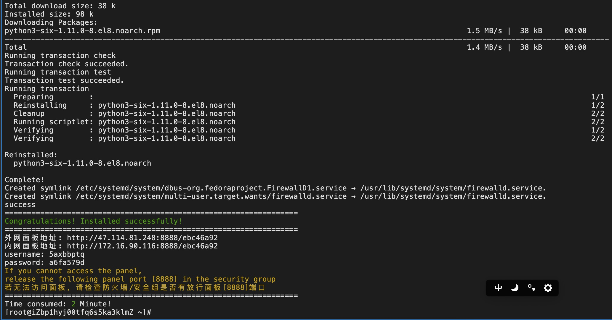
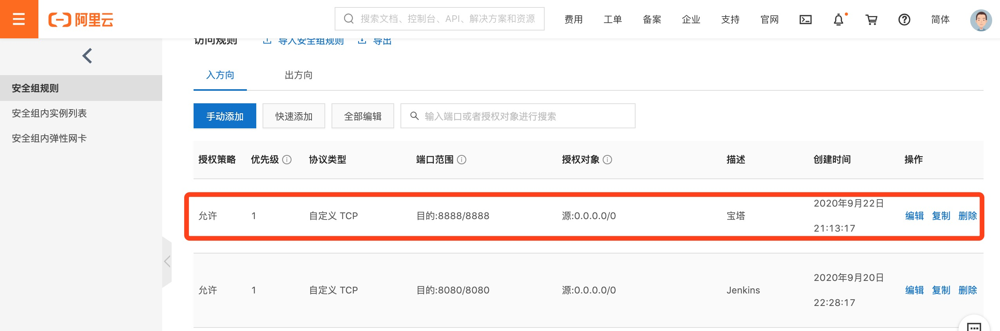
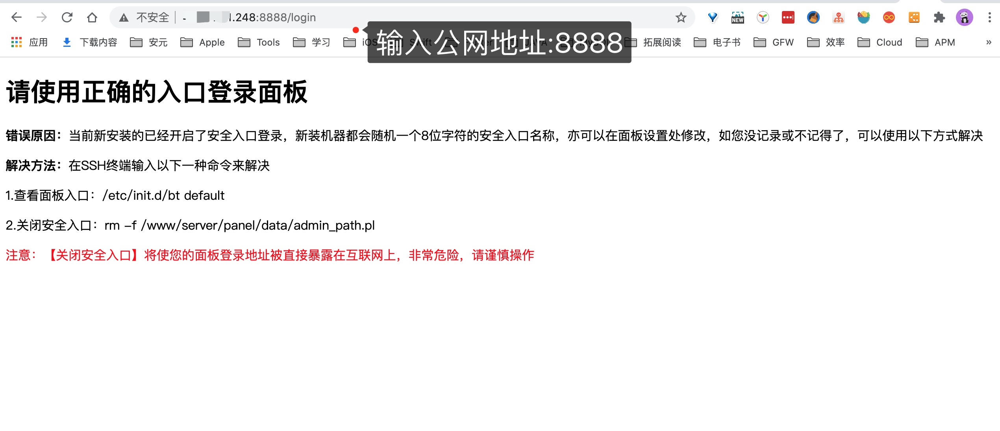
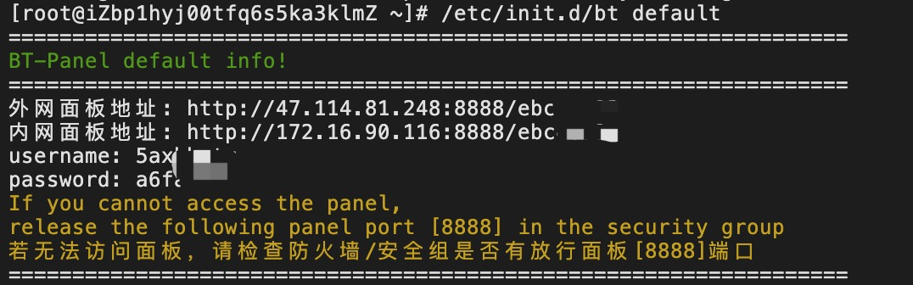
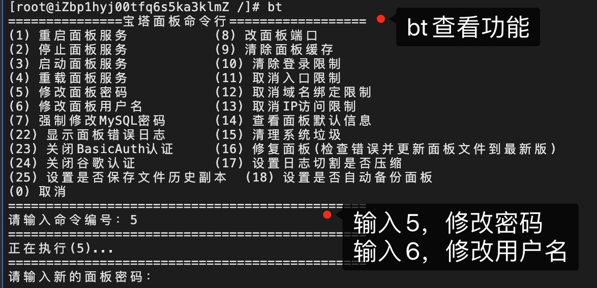
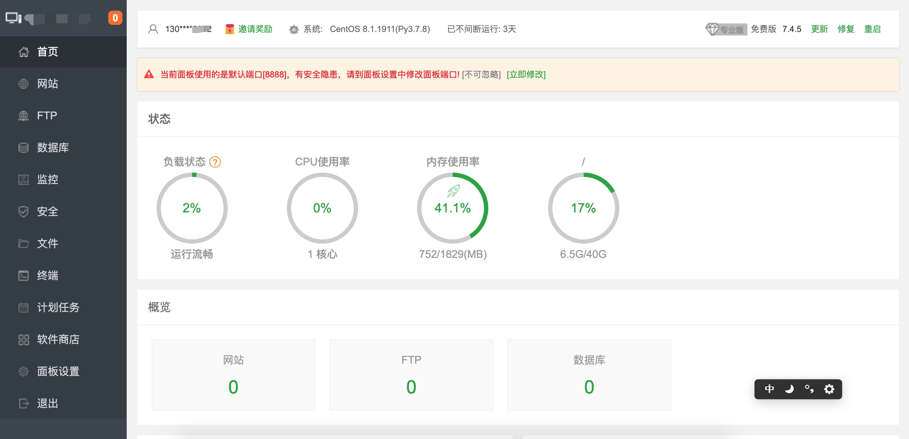

[宝塔官网](https://www.bt.cn/download/linux.html)

[宝塔Linux面板安装教程 - 2020年8月28日更新 - 7.4.5正式版](https://www.bt.cn/bbs/thread-19376-1-1.html)

[面板管理常用命令](https://www.bt.cn/btcode.html)


[【教程】阿里云服务器ECS如何安装宝塔面板？](https://developer.aliyun.com/article/738522)


## 安装要求

内存：512M以上，推荐768M以上（纯面板约占系统60M内存）

硬盘：300M以上可用硬盘空间（纯面板约占20M磁盘空间）

系统：CentOS 7.1+ (Ubuntu16.04+.、Debian9.0+)，**确保是干净的操作系统，**没有安装过其它环境带的Apache/Nginx/php/MySQL/pgsql/gitlab/java**（已有环境不可安装）**

架构：x86_64（主流服务器均是此架构），ARM不完整兼容（面板环境安装慢，部分软件可能安装不上）


**宝塔Linux面板7.4.5版本是基于Centos开发的，为了最好的兼容性，请优先考虑使用Centos8.x系统**

系统兼容性顺序：

Centos8.x > Centos7.x > Ubuntu18.04 > Debian10 > Ubuntu 20.04 > 其它系统

提示：Centos官方已宣布在2020年停止对Centos6的维护更新，各大软件开发商也逐渐停止对Centos6的兼容，新服务器不建议使用Centos6


**以下主机商必看（开端口教程，不开不能用）：**

腾讯云：https://www.bt.cn/bbs/thread-1229-1-1.html [腾讯云2折起](https://cloud.tencent.com/redirect.php?redirect=1014&cps_key=624d99e25c64927aef8353ed6cd5536c&from=console)

阿里云：https://www.bt.cn/bbs/thread-2897-1-1.html [阿里云2折起](https://promotion.aliyun.com/ntms/act/qwbk.html?userCode=wkpc565a)
华为云：https://www.bt.cn/bbs/thread-3923-1-1.html [华为云1折起](https://activity.huaweicloud.com/invate00/invate00.html?fromacct=c25bfc10-c8ff-48f7-924d-792dd7706772&utm_source=V1g3MDY4NTY=&utm_medium=cps&utm_campaign=201905)


## 安装

CentOS安装

```
$ yum install -y wget && wget -O install.sh http://download.bt.cn/install/install_6.0.sh && sh install.sh
```




## 开放阿里云8888端口




## 面板操作

[面板管理常用命令](https://www.bt.cn/btcode.html)

* 宝塔工具箱(包含下列绝大部分功能 直接ssh中执行bt命令 仅限6.x以上版本面板)

```
bt
```

* 启动

```
$ bt start
$ /etc/init.d/bt start
```

* 停止

```
$ bt stop
$ /etc/init.d/bt stop
```

* 重启

```
$ bt restart
$ /etc/init.d/bt restart
```


## 面板特色功能

- 一键配置服务器环境（LAMP/LNMP）
- 一键安全重启
- 一键创建管理网站、ftp、数据库
- 一键部署SSL证书
- 一键部署源码（discuz、wordpress、dedecms、z-blog、微擎等等）
- 一键配置（定期备份、数据导入、伪静态、301、SSL、子目录、反向代理、切换PHP版本）
- 一键安装常用PHP扩展(fileinfo、intl、opcache、imap、memcache、apc、redis、ioncube、imagick)
- 数据库一键导入导出
- 系统监控（CPU、内存、磁盘IO、网络IO）
- 防火墙端口放行
- SSH开启与关闭及SSH端口更改
- 禁PING开启或关闭
- 方便高效的文件管理器（上传、下载、压缩、解压、查看、编辑等等）
- 计划任务（定期备份、日志切割、shell脚本）
- 软件管理（一键安装、卸载、版本切换）


## 打开外网网址:8888

> 打开外网地址:8888访问，提示我们使用安全登录，避免直接暴露在互联网上。



**查看面板入口，可以看到 外网面板地址 和 用户名 和 密码**




**重置宝塔username和password**




**输入宝塔默认网址**



