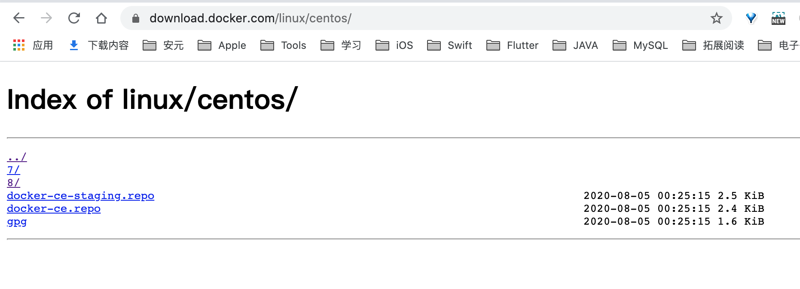
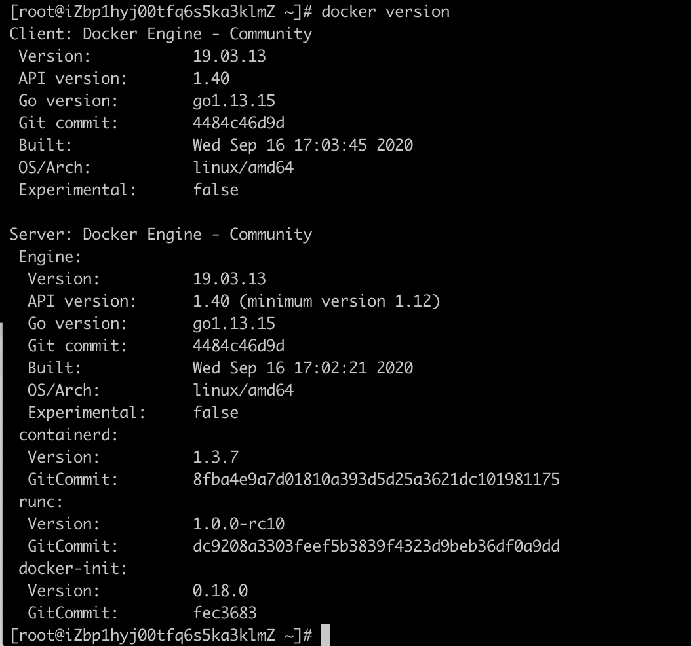
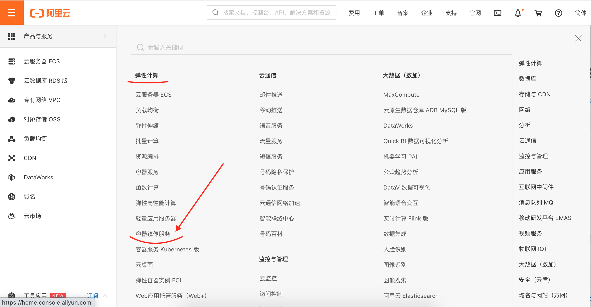
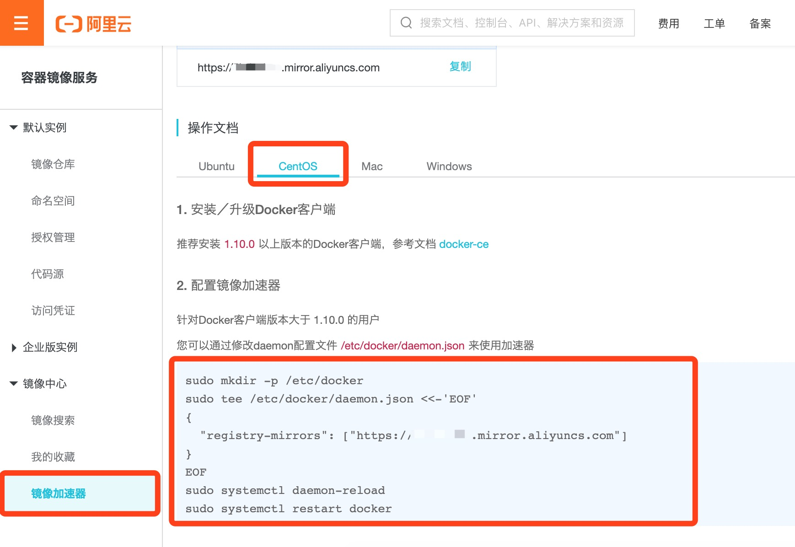
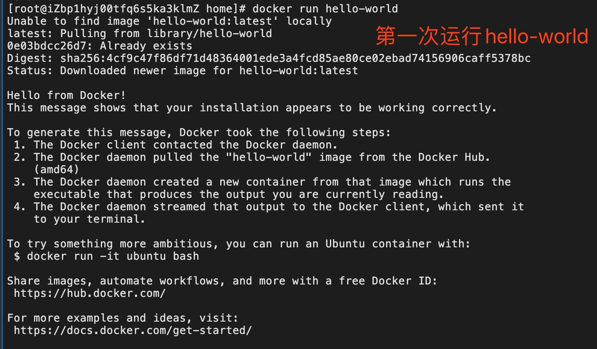
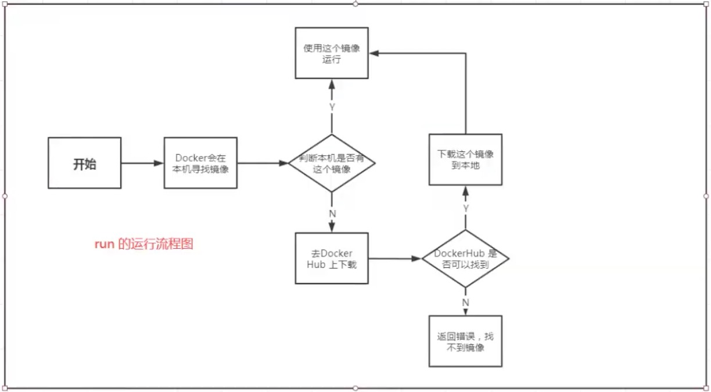
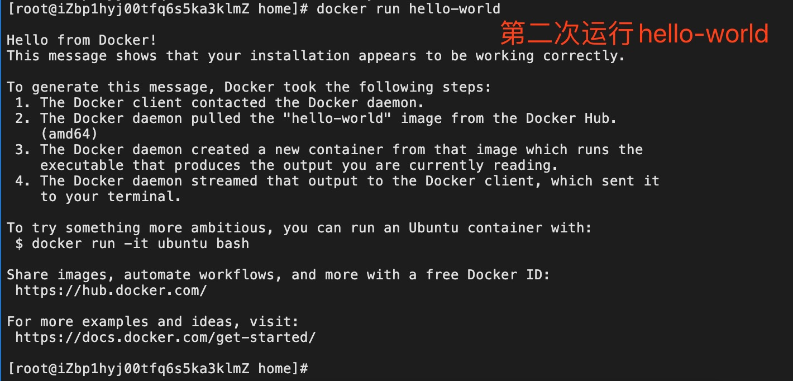
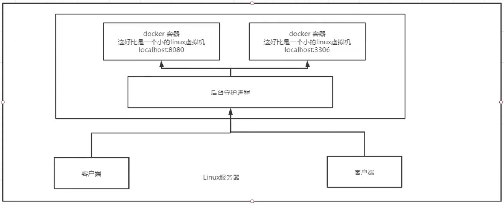
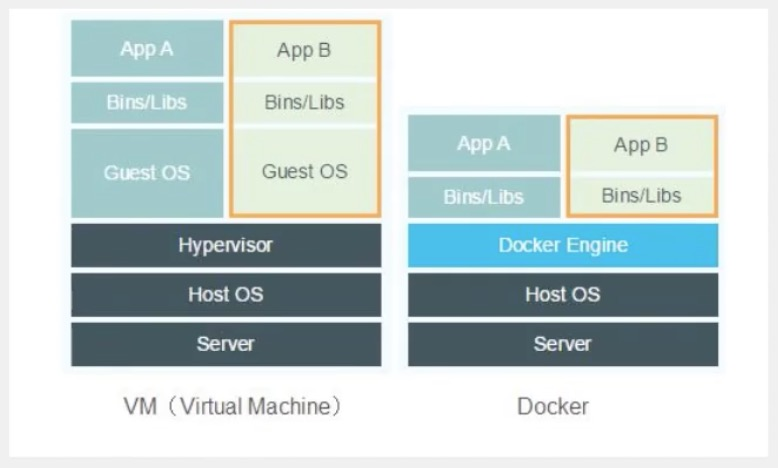

[Docker官网](https://www.docker.com/)

[Docker docs](https://docs.docker.com/)

[Dockor docs - CentOS install Dockor](https://docs.docker.com/engine/install/centos/)


[GitBook - Docker从入门到实践](https://yeasy.gitbook.io/docker_practice/)


# 一、Docker历史


# 二、Docker能做什么


# 三、Docker名词


## 1、镜像（image）

> Docker镜像好比一个模板，可以通过这个模板来创建容器服务。通过这个镜像可以创建多个容器，最终服务或项目运行就是在容器中。
>
> 类比：镜像 = Class，容器 = 实例。
>
> tomcat镜像 ===> run  ===> tomcat01容器
>
> tomcat镜像 ===> run  ===> tomcat02容器


## 2、容器（container）

> 容器是由镜像创建的。Docker利用容器技术，独立运行一个或一组应用。
>
> 类比：可以把容器理解为一个简易的linux系统。

基本命令：启动、停止、删除等；


## 3、仓库（repository）

> 仓库就是放镜像的地方！
>
> 仓库分为公有仓库和私有仓库。
>
> Docker Hub （默认国外的）
>
> 阿里云...都有容器服务（配置镜像加速）


#四、CentOS安装Docker

> 参考自官方文档 
>
> [Dockor docs - CentOS install Dockor](https://docs.docker.com/engine/install/centos/)


## 1、移除旧版Docker

> 较旧的Docker版本称为`docker`或`docker-engine`；
>
> 现在将Docker Engine软件包称为`docker-ce`。

```
$ sudo yum remove docker \
                  docker-client \
                  docker-client-latest \
                  docker-common \
                  docker-latest \
                  docker-latest-logrotate \
                  docker-logrotate \
                  docker-engine
```


## 2、Docker安装方式有多种

```
a.大多数用户会 设置Docker的存储库并从中进行安装，以简化安装和升级任务。这是推荐的方法。

b.一些用户下载并手动安装 RPM软件包， 并完全手动管理升级。这在诸如在无法访问互联网的空白系统上安装Docker的情况下非常有用。

c.在测试和开发环境中，一些用户选择使用自动 便利脚本来安装Docker。
```


## 3、使用存储库安装

安装`yum-utils`软件包（提供`yum-config-manager` 实用程序）

```
$ sudo yum install -y yum-utils
```

设置镜像仓库，默认是国外的，推荐阿里云的。

```shell
$ sudo yum-config-manager \
    --add-repo \
    https://download.docker.com/linux/centos/docker-ce.repo      # 默认国外的
    
$ sudo yum-config-manager \
    --add-repo \
    http://mirrors.aliyun.com/docker-ce/linux/centos/docker-ce.repo  # 推荐阿里云
```




## 4、可选项：

启用**每晚**存储库命令：

```
$ sudo yum-config-manager --enable docker-ce-nightly
```

要启用**测试**通道，请运行以下命令：

```
$ sudo yum-config-manager --enable docker-ce-test
```

禁用**夜间**存储库命令：

```
$ sudo yum-config-manager --disable docker-ce-nightly
```


## 5、安装 Docker Engine

安装 **最新版本** 的Docker Engine和容器

> docker-ce 社区版    ee 企业版

```
$ sudo yum install docker-ce docker-ce-cli containerd.io
```


安装 **特定版本** Docker Engine

* 列出并排序您存储库中可用的版本。本示例按版本号（从高到低）对结果进行排序，并被截断：

  ```
  $ yum list docker-ce --showduplicates | sort -r
  ```

* 通过其完全合格的软件包名称安装特定版本，该软件包名称是软件包名称（`docker-ce`）加上版本字符串（第二列），从第一个冒号（`:`）到第一个连字符，以连字符（`-`）分隔。例如，`docker-ce-18.09.1`。

  ```
  $ sudo yum install docker-ce-<VERSION_STRING> docker-ce-cli-<VERSION_STRING> containerd.io
  ```


6、安装最新版本遇到的问题

```
[root@iZbp1hyj00tfq6xxxxxxxx ~]# sudo yum install docker-ce docker-ce-cli containerd.io
Last metadata expiration check: 0:05:53 ago on Sat 19 Sep 2020 12:54:46 AM CST.
Error: 
 Problem: package docker-ce-3:19.03.13-3.el7.x86_64 requires containerd.io >= 1.2.2-3, but none of the providers can be installed
  - cannot install the best candidate for the job
  - package containerd.io-1.2.10-3.2.el7.x86_64 is filtered out by modular filtering
  - package containerd.io-1.2.13-3.1.el7.x86_64 is filtered out by modular filtering
  - package containerd.io-1.2.13-3.2.el7.x86_64 is filtered out by modular filtering
  - package containerd.io-1.2.2-3.3.el7.x86_64 is filtered out by modular filtering
  - package containerd.io-1.2.2-3.el7.x86_64 is filtered out by modular filtering
  - package containerd.io-1.2.4-3.1.el7.x86_64 is filtered out by modular filtering
  - package containerd.io-1.2.5-3.1.el7.x86_64 is filtered out by modular filtering
  - package containerd.io-1.2.6-3.3.el7.x86_64 is filtered out by modular filtering
  - package containerd.io-1.3.7-3.1.el7.x86_64 is filtered out by modular filtering
(try to add '--skip-broken' to skip uninstallable packages or '--nobest' to use not only best candidate packages)
[root@iZbp1hyj00tfq6s5xxxxxx ~]# 
```

【问题】：containerd.io 版本过低

【原因】：最新的 docker-ce 需要安装最新的 containerd.io ，可以查看安装包，应该版本不够。

【解决】：两个方案：降低Docker版本 或 安装最新containerd.io

1. 安装最新的 containerd.io-1.2.6：https://download.docker.com/linux/centos/8/x86_64/stable/Packages/ 

```
$ yum install -y https://download.docker.com/linux/centos/8/x86_64/stable/Packages/containerd.io-1.3.7-3.1.el8.x86_64.rpm
```

2. 再安装剩下两个包

```
$ sudo yum install docker-ce docker-ce-cli
```


## 7、启动Docker Engine

```
$ sudo systemctl start docker
```


## 8、设置Docker Engine为开机自启

```
[root@localhost ~]# sudo systemctl enable docker

Created symlink /etc/systemd/system/multi-user.target.wants/docker.service → /usr/lib/systemd/system/docker.service.
```


## 9、验证是否安装成功

```
$ docker version
```




## 10、运行hello-world

通过运行`hello-world` 映像来验证是否正确安装了Docker Engine 。

```shell
$ sudo docker run hello-world

// ...
Hello from Docker!
This message shows that your installation appears to be working correctly.
// ...
```


## 11、查看hello-world镜像

```Shell
$ docker iamges
REPOSITORY          TAG                 IMAGE ID            CREATED             SIZE
hello-world         latest              bf756fb1ae65        8 months ago        13.3kB
```


##  12、升级Docker Engine

要升级Docker Engine，请按照[安装说明](https://docs.docker.com/engine/install/centos/#install-using-the-repository)，选择要安装的新版本。


## 13、卸载Docker Engine

卸载Docker Engine，CLI和Containerd软件包：

```
$ sudo yum remove docker-ce docker-ce-cli containerd.io
```

主机上的映像，容器，卷或自定义配置文件不会自动删除。 要删除所有图像，容器和卷：

```
$ sudo rm -rf /var/lib/docker
```


# 五、阿里云镜像加速

## 1、打开阿里云，找到『容器镜像服务』




## 2、找到镜像加速




## 3、设置

```
sudo mkdir -p /etc/docker
sudo tee /etc/docker/daemon.json <<-'EOF'
{
  "registry-mirrors": ["https://5hd5simo.mirror.aliyuncs.com"]
}
EOF
sudo systemctl daemon-reload
sudo systemctl restart docker
```


## 六、docker run hello-world流程








# 六、底层原理

## 1、Docker是怎么工作的？

Docker是一个 Client-Server 结构的系统，Docker的守护进程在主机上。通过Socket从客户端访问。

DockerServer接收到 DockerClient的指令，就会执行这个指令！




## 2、Docker为什么比VM快？

1. Dcoker有着比虚拟机更少的抽象层；
2. Docker利用宿主主机的内核，VM需要Guest OS。




