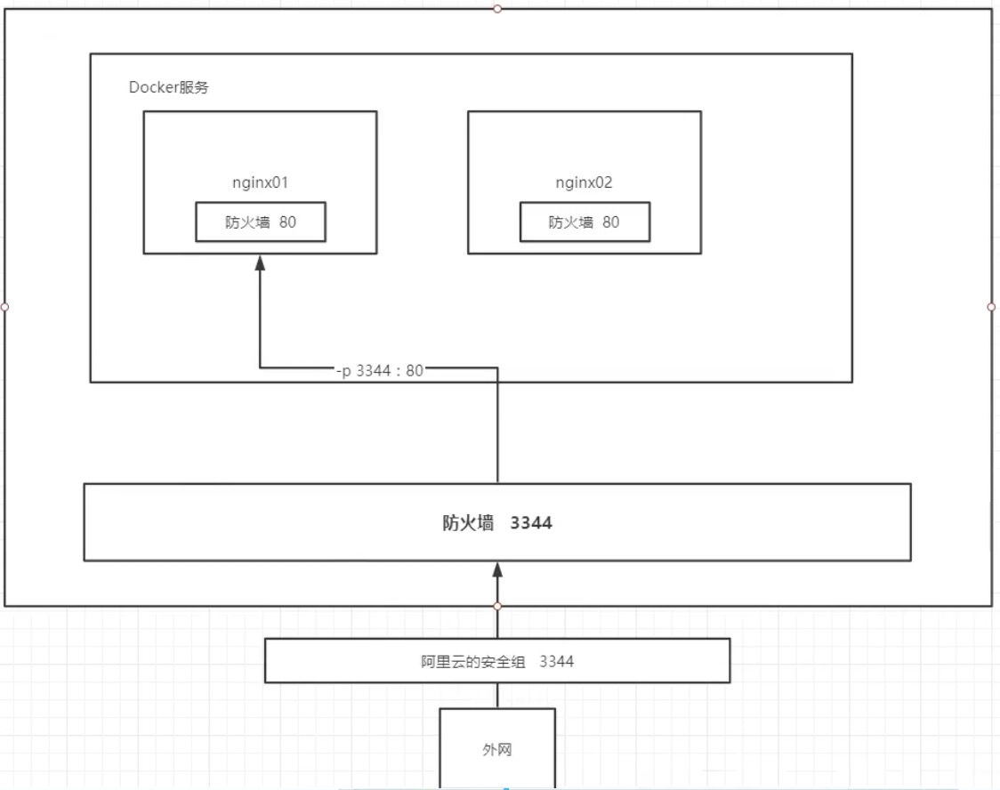
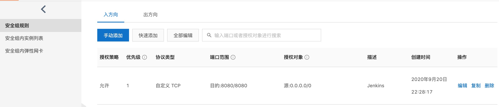
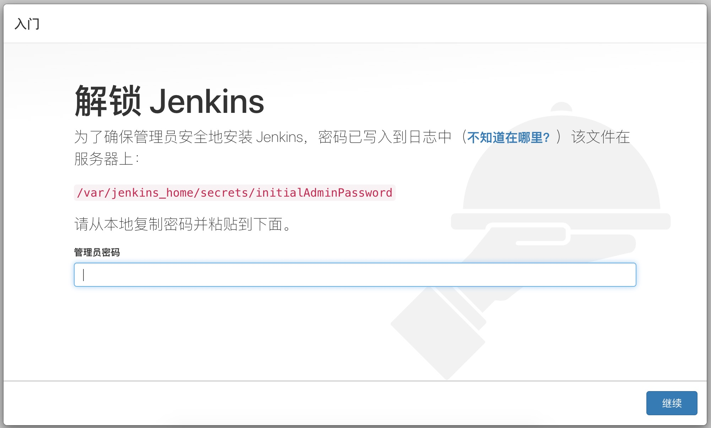

[Jenkins Docs](https://www.jenkins.io/doc/)

[Jenkins Docs - Installing Jenkins](https://www.jenkins.io/doc/book/installing/)

[Docker Hub - jenkinsci/blueocean](https://hub.docker.com/r/jenkinsci/blueocean)


[使用 Docker 安装 Jenkins 的方式](https://segmentfault.com/a/1190000021925039)

[Jenkins，docker实现自动化部署（持续交互）](https://developer.aliyun.com/article/611302)


# 一、CentOS部署Jenkins方式

云端部署Jenkins有多种方式：

1. 下载Jenkins包上传到阿里云，手动安装
2. Docker


# 二、选择Jenkins版本

> 推荐使用的Docker映像是 [`jenkinsci/blueocean`映像](https://hub.docker.com/r/jenkinsci/blueocean/) （来自[Docker Hub存储库](https://hub.docker.com/)）。
>
> ----- 摘自《[Jenkins Docs - Installing Jenkins](https://www.jenkins.io/doc/book/installing/)》


## 2.1、search Jenkins

1. 命令行搜索

```shell
$ docker search jenkins
NAME                                   DESCRIPTION                                     STARS               OFFICIAL            AUTOMATED
jenkins                                Official Jenkins Docker image                   4913                [OK]                
jenkins/jenkins                        The leading open source automation server       2227                                    
jenkinsci/blueocean                    https://jenkins.io/projects/blueocean           566                                     
jenkinsci/jenkins                      Jenkins Continuous Integration and Delivery …   383                                     
jenkins/jnlp-slave                     a Jenkins agent which can connect to Jenkins…   134 
//....
```

2. 网页搜索 [Docker Hub](https://hub.docker.com/)


## 2.2、Docker下载Jenkins

```shell
$ docker pull jenkinsci/blueocean:lts     # 最新版
```


## 2.3、查看Jenkins镜像

```shell
# 查看所有本地主机上的镜像
$ docker images
# 查看镜像元数据
$ docker inspect jenkins镜像ID

# 操作
$ docker images
REPOSITORY          TAG                 IMAGE ID            CREATED             SIZE
jenkinsci/blueocean   latest            c67eafa3612f        3 hours ago         755MB
centos                latest            0d120b6ccaa8        5 weeks ago         215MB
```


# 三、根据镜像创建Jenkins容器

## 方式一：

> 直接运行，运行期间产生的所有数据都保存在容器内部，容器销毁，数据丢失。

## 方式二：

>Docker会在主机上创建一个数据卷，容器映射该卷以持久化数据。


# 四、直接创建容器(方式一)

```shell
$ docker run -p 8080:8080 jenkinsci/blueocean

//...........
*************************************************************
*************************************************************
*************************************************************

Jenkins initial setup is required. An admin user has been created and a password generated.
Please use the following password to proceed to installation:

a3cf7a1095034e05a1b7de68c878e874

This may also be found at: /var/jenkins_home/secrets/initialAdminPassword

*************************************************************
*************************************************************
*************************************************************
//...........
```


## 4.1、查看Jenkins启动情况

```shell
$ docker ps
$ docker ps | grep jenkinsci/blueocean
```


## 4.2、宿主主机端口要开启

```
因为本操作是在阿里云ECS上进行安装的，需要在安全组里开放8080此端口。
```







## 4.3、访问『阿里云公网地址:8080』




# 四、配置Jenkins


