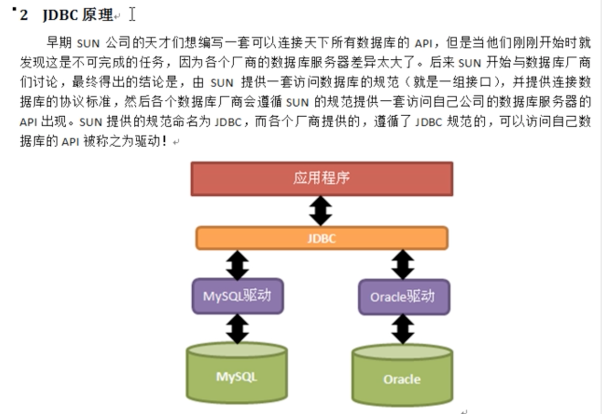
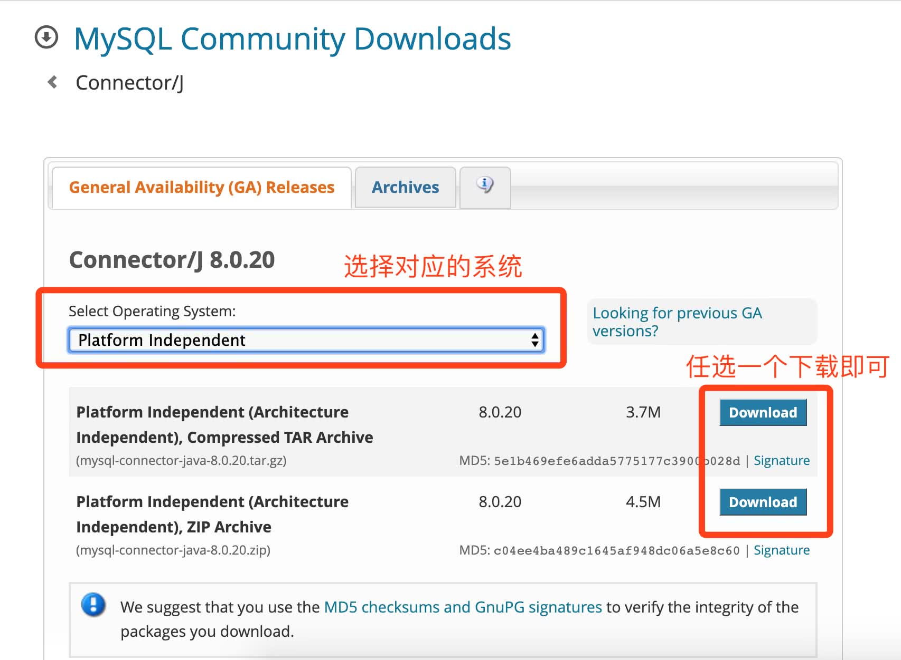
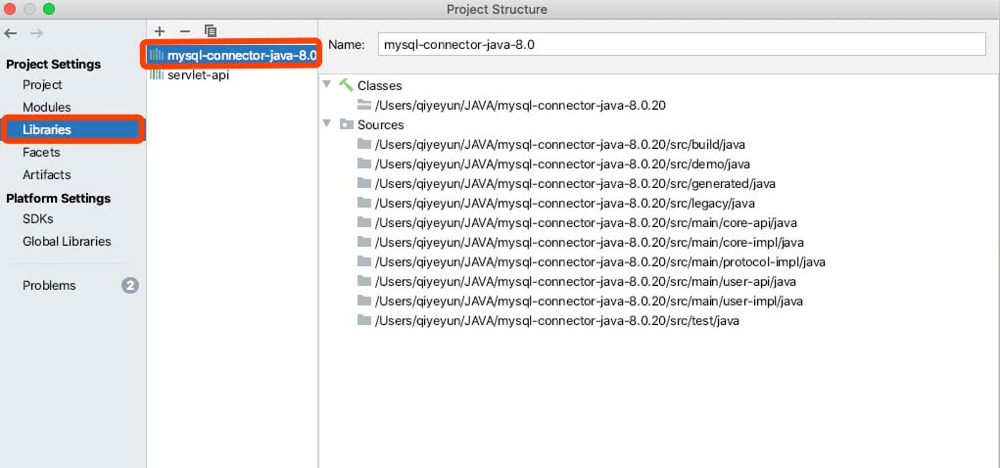
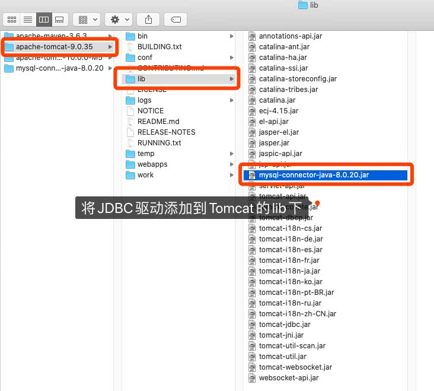

阿里云学习课程：[JDBC学习](https://developer.aliyun.com/learning/course/29/detail/628)

# JDBC

## 1、介绍

> **Java数据库连接**（**Java Database Connectivity**，简称**JDBC**）
>
> JDBC是Java语言中用来规范客户端程序如何来访问数据库的应用程序接口（统一的编程API），提供了诸如查询和更新数据库中数据的方法。
>
> Sun公司无法针对各个不同的服务器厂商编写不同的数据库连接代码，所以Sun公司决定提供一套API，让凡是想数据库与Java连接的数据库厂商必须自己 **实现JDBC这套接口**，而数据库厂商的JDBC的实现，我们也称作它为 **数据库的驱动** 。




```java
/**
 * JDBC 四个配置 连接不同的数据库
 */
// MySQL 8.0 以下版本 - JDBC 驱动名及数据库 URL
static final String JDBC_DRIVER = "com.mysql.jdbc.Driver";
// MySQL 8.0 以上版本 - JDBC 驱动名及数据库 URL
static final String JDBC_DRIVER = "com.mysql.cj.jdbc.Driver";
static final String DB_URL = "jdbc:mysql://localhost:3306/QYC";      // 端口号可通过命令查看
// 数据库的用户名与密码，需要根据自己的设置
static final String USERNAME = "root";
static final String PASSWORD = "11111111";
```

```shell
# 查看MySQL端口号
mysql> show global variables like 'port';
+---------------+-------+
| Variable_name | Value |
+---------------+-------+
| port          | 3306  |
+---------------+-------+
1 row in set (0.01 sec)
```


## 2、JAVA访问数据库流程

使用JDBC应用程序向表中插入数据记录需要以下步骤：

* 导入包：需要包含包含数据库编程所需的JDBC类的包。 大多数情况下，使用import java.sql.*就足够了。
* 注册JDBC驱动程序：需要初始化驱动程序，以便可以程序中打开数据库的通信通道。
* 打开连接：需要使用`DriverManager.getConnection()`方法来创建一个Connection对象，它表示与数据库服务器的物理连接。
* 执行查询：需要使用类型为Statement的对象来构建和提交SQL语句，以在选择的数据库的表中插入数据记录。
* 清理环境：需要明确地关闭所有数据库资源，而不依赖于JVM的垃圾收集。


## 3、下载MySQL数据库驱动

> 下载地址：https://dev.mysql.com/downloads/connector/j/




## 4、导入MySQL驱动 【重点】

### 1、项目导入



### 2、Tomcat导入




## 5、【代码】Java程序连接MySQL

```java
package com.linx;
import java.sql.*;

public class JDBCManager {
    // MySQL 8.0 以上版本 - JDBC 驱动名及数据库 URL
    static final String JDBC_DRIVER = "com.mysql.cj.jdbc.Driver";
    static final String DB_URL = "jdbc:mysql://localhost:3306/LX_DB";
    // 数据库的用户名与密码，需要根据自己的设置
    static final String USERNAME = "root";
    static final String PASSWORD = "11111111";

    /**
     * @param
     * @throws ClassNotFoundException: 异常：没导入mysql连接包
     * @throws SQLException：异常：检查URL、username、password是否正确，或者MySQL没有启动
     */
    public void startJDBC() throws ClassNotFoundException, SQLException {
        // 1.注册 JDBC 驱动
        Class.forName(JDBC_DRIVER);
        // 2.获取连接对象
        Connection conn = DriverManager.getConnection(DB_URL, USERNAME, PASSWORD);
        System.out.println(conn);
    }
}
```


# 如何连接云数据库


