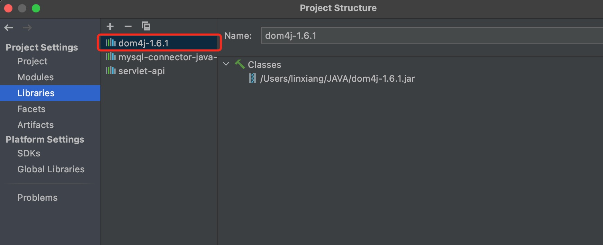

[Java XML解析 - 利用SAX（Simple API for XML）解析XML](http://www.51gjie.com/java/737.html)


# XML简介

```xml
<?xml version='1.0' encoding='UTF-8'?>
<books>
    <book id="12">
        <name>thinking in java</name>
        <price>85.5</price>
    </book>
    <book id="15">
        <name>Spring in Action</name>
        <price>39.0</price>
    </book>
</books>
```

`<books>、<book>` ：这种节点就属于ElementNode；

而 `thinking in Java、85.5 ` 这种就属于TextNode。

# XML解析

Java中用于解析XML的技术很多，主流的有DOM、SAX、JDOM、DOM4j等。

**解析方式** 有两种,一种叫 **SAX (Simple API for XML)**，另一种叫 **DOM (Document Object Model)**。

* SAX解析属于流解析，从上至下，解析完成即止。
* Dom解析是文档树，将XML加载到内存中，可以任意取值。

SAX不需要jar包，类在 **org.xml.sax** 中；

Dom需要jar包：[Dom4J](https://mvnrepository.com/artifact/dom4j/dom4j)


## 导入jar包




## 具体操作代码（未完善）


```java
import org.dom4j.


```


