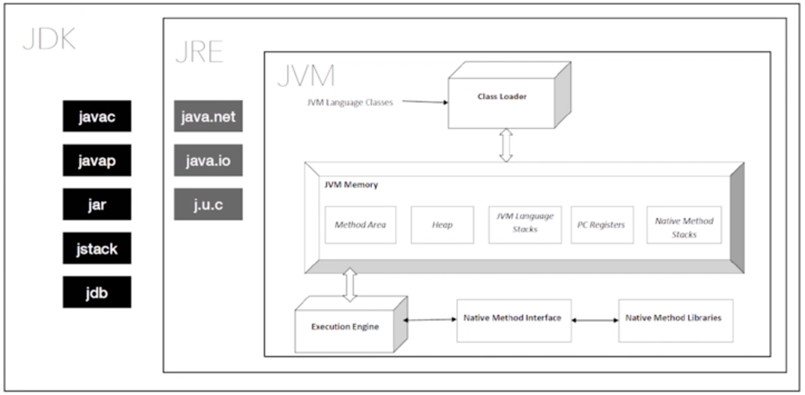

* [深入理解 Java JDK —— 让我们从基础到进阶](https://developer.aliyun.com/article/1649872?scm=20140722.ID_community@@article@@1649872._.ID_community@@article@@1649872-OR_rec-PAR1_0b16399317537176119013414ed6b2-V_1-RL_community@@article@@1143607)


# 一、Java 简介

Java是由Sun Microsystems公司于1995年5月推出的Java面向对象程序设计语言和Java平台的总称。由James Gosling和同事们共同研发，并在1995年正式推出。

Java分为三个体系：

- JavaSE（J2SE）（Java2 Platform Standard Edition，java平台标准版）
- JavaEE（J2EE）（Java 2 Platform Enterprise Edition，java平台企业版）
- JavaME（J2ME）（Java 2 Platform Micro Edition，java平台微型版）。

2005年6月，JavaOne大会召开，SUN公司公开Java SE 6。此时，Java的各种版本已经更名以取消其中的数字"2"：J2EE更名为Java EE, J2SE更名为Java SE，J2ME更名为Java ME。


## Java应用运行机制

计算机高级语言主要有『编译型』和『解释型』，Java语言是这两种的结合。

``` 
源文件(*.java) -> Java编译器(javac) -> 字节码文件(*.class) -> JRE[类装载器 -> 字节码校验 -> 解释器] -> 系统平台
```


## JVM、JRE、JDK

JVM（Java Virtual Mechine）：Java虚拟机。

JRE（Java Runtime Environment）：Java运行环境，包含：Java虚拟机、库函数、运行Java程序必须的文件。

JDK（Java Development Kit）：Java开发工具包，包含JRE、编译器、调试器等用于程序开发的文件。

* 如果只要运行Java程序，只需要JRE即可。
* 如果开发Java程序，就需要安装JDK。




## 跨平台

> 因为有了虚拟机，来适配不同的平台。

```
											JVM for Unix
源文件(*.java) -> 字节码文件(*.class) ------>  JVM for Windows
										    JVM for Other
```


## JDK安装

Oracle官网：https://www.oracle.com/java/technologies/javase-jdk8-downloads.html

```
// 查看JDK版本
$ ➜ java -version
java version "1.8.0_191"
Java(TM) SE Runtime Environment (build 1.8.0_191-b12)
Java HotSpot(TM) 64-Bit Server VM (build 25.191-b12, mixed mode)

// 查看JDK安装版本 & 路径
$ ➜ /usr/libexec/java_home -V
Matching Java Virtual Machines (1):
    1.8.0_191, x86_64:	"Java SE 8"	/Library/Java/JavaVirtualMachines/jdk1.8.0_191.jdk/Contents/Home

/Library/Java/JavaVirtualMachines/jdk1.8.0_191.jdk/Contents/Home
```


## JDK环境变量

```objectivec
JAVA_HOME       配置JDK安装路径
CLASSPAHT       配置类库文件位置
PATH            配置JDK命令文件位置
  
// 具体路径
export JAVA_HOME=/Library/Java/JavaVirtualMachines/jdk1.8.0_191.jdk/Contents/Home
  
export CLASSPAHT=.:$JAVA_HOME/lib/dt.jar:$JAVA_HOME/lib/tools.jar

export PATH=$JAVA_HOME/bin:$PATH:
```

用 `source .bash_profile` 使配置生效，输入 `echo $JAVA_HOME` 显示刚才配置的路径。

```
➜  ~ echo $JAVA_HOME 
/Library/Java/JavaVirtualMachines/jdk1.8.0_191.jdk/Contents/Home
```

**遇到问题： `echo $JAVA_HOME` 不生效**

oh-my-zsh的配置文件为`.zshrc`，而默认shell（bash）的配置文件为`.bash_profile` 。

* 方法一：在.zshrc中添加环境变量，`source.zshrc` 使Zsh配置文件生效。

* 方法二：在.bash_profile添加环境变量，在.zshrc中添加代码：`source ~/.bash_profile`，再运行`source.zshrc` 使Zsh配置文件生效。


## 第一个Java程序

```
public class Welcome {
	public static void main(String[] args) {
		System.out.println("hello world");
	}
}
class test {
}

// 注意点
1.类名与文本名称必须一致：Welcome.java
2.javac Welcome.java 生成 Welcome.class、test.class
3.运行 java Welcome
4.一个源文件可以对应多个类，但只允许一个public类；
5.main方法是入口；
```


