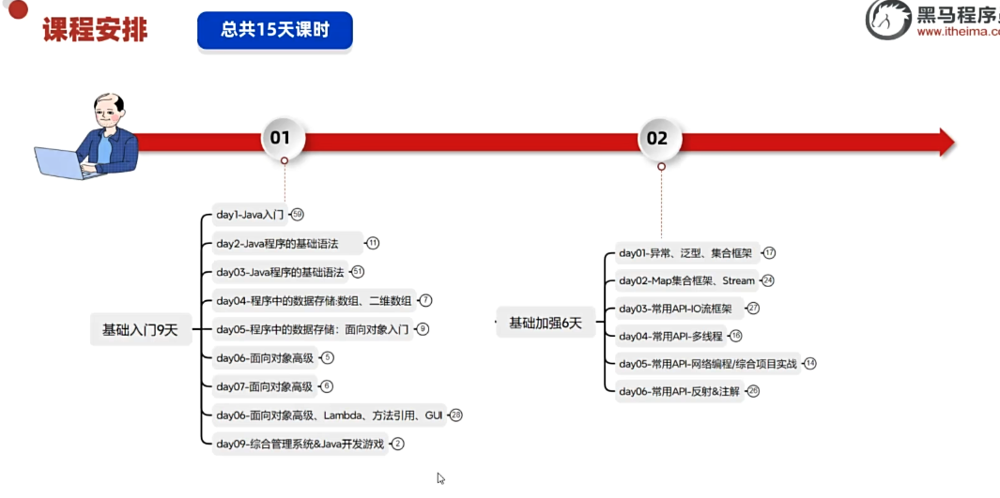
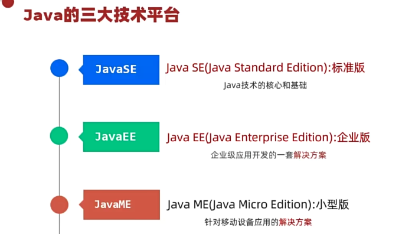
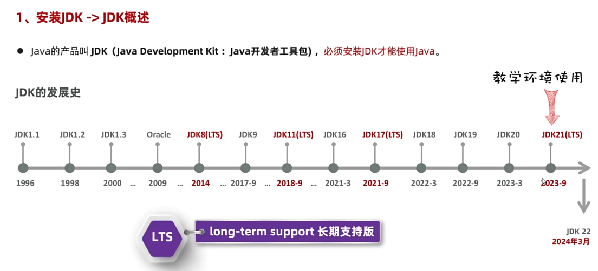
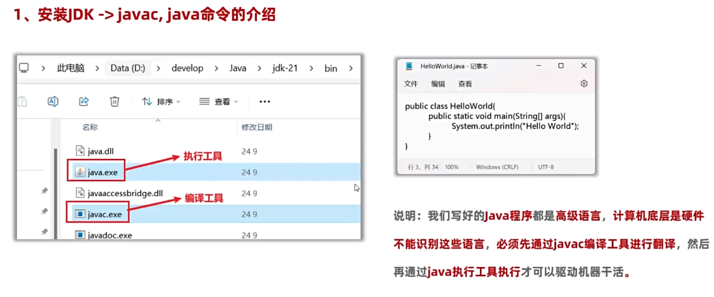
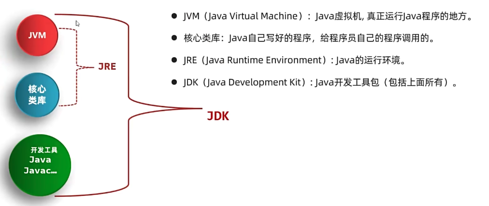
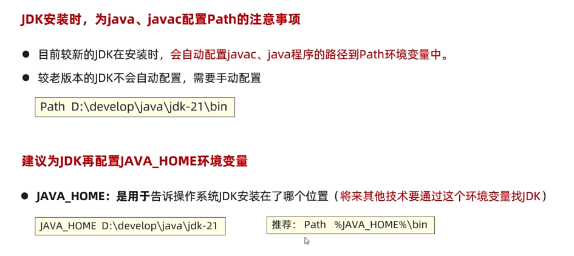
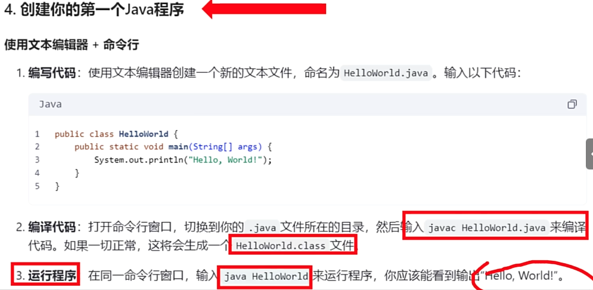
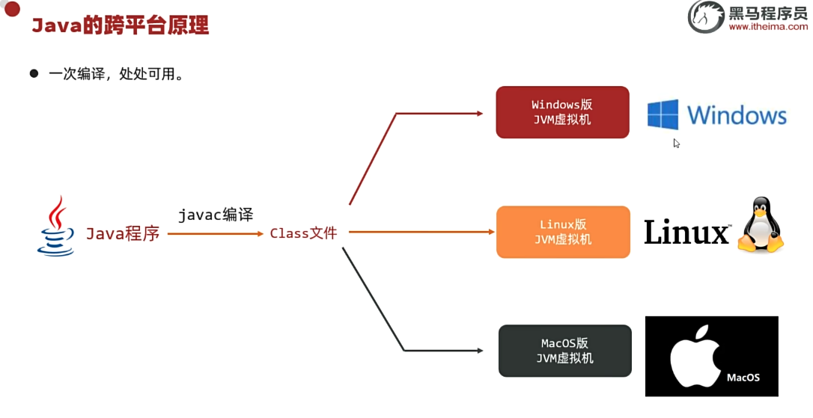

* 学习视频：黑马


# 一、初步

 

## 1. Java三个技术平台




* Java SE 是后面两个的基础


# 二、编写第一个Java程序

## 1. 安装JDK 与 JDK介绍




## 2. 查看Java版本、卸载旧版本、安装新版本

```sh
$ javac -version                                                               ✔  00:50:24
javac 24.0.1

$ java -version                                                                ✔  00:50:01
openjdk version "24.0.1" 2025-04-15
OpenJDK Runtime Environment (build 24.0.1+9-30)
OpenJDK 64-Bit Server VM (build 24.0.1+9-30, mixed mode, sharing)

$ which java                                                                   ✔  00:50:02
/usr/bin/java

$ where java                                                                   ✔  00:50:16
/usr/bin/java
```




## 3. JVM、JRE、JDK、核心类库




## 4. 配置环境变量

* PATH环境变量：为了让Java命令能够在任何位置运行；
* 目前新版会自动安装PATH；
* 建议配置 JAVA_HOME 便于其他功能寻找这个环境变量。



## 5. Hello World！




## 6. Java 跨平台原理




