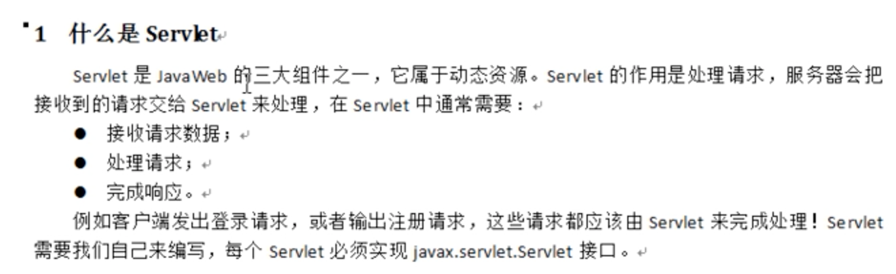
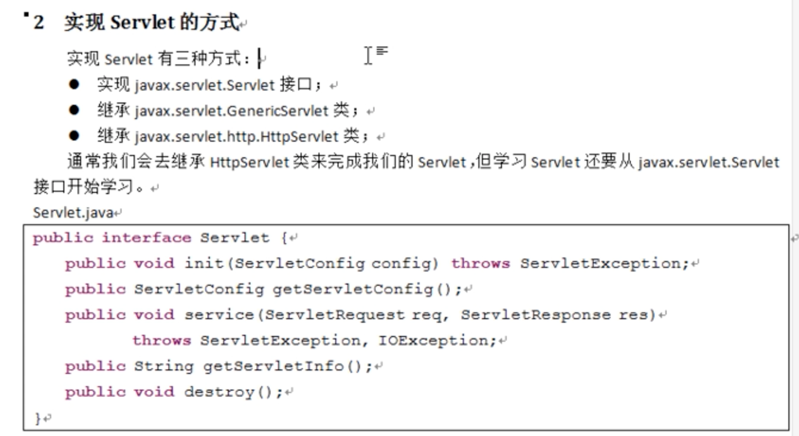
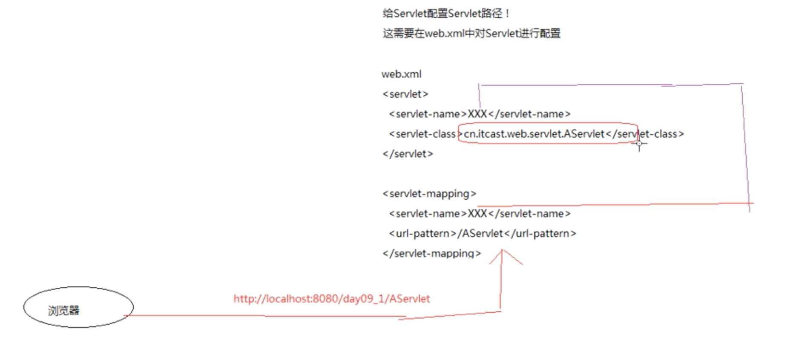
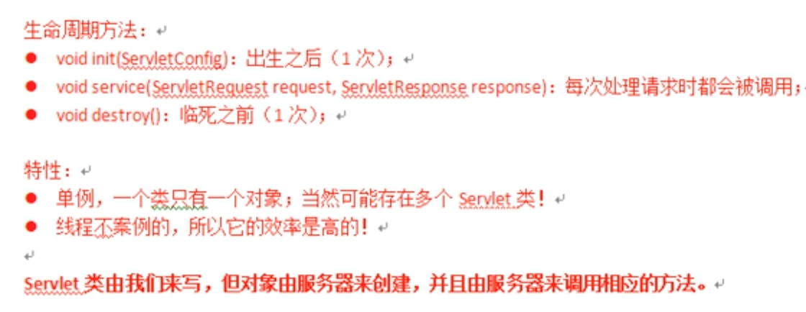

# 什么是Servlet

> JavaWeb三大组件：Servlet、Filter、listener









# Servlet包

[mvnrepository下载 servlet-api.jar](https://mvnrepository.com/artifact/javax.servlet/javax.servlet-api)

或者 Tomcat/lib/servlet-api.jar


# 转发与重定向

```

```


# 反射- Reflection

> 反射：把Java类中的各种结构（方法、属性、构造器、类名）映射成一个个的Java对象。利用发射技术可以对一个类进行解剖，反射是框架设计的灵魂。

```java
package com.lx.server.basic;

public class ReflectTest {
    public static void main(String[] args) throws ClassNotFoundException, IllegalAccessException, InstantiationException, NoSuchMethodException, InvocationTargetException {
        // 获取Class三种方式
        // 1.对象.getClass();
        iPhone ip = new iPhone();
        Class clz = ip.getClass();
        // 2.类.class()
        Class clz1 = iPhone.class;
        // 3.Class.forName("包名.类名")
        Class clz2 = Class.forName("com.lx.server.basic.iPhone");
        
         // 创建对象
//        iPhone ip2 = (iPhone)clz.newInstance();   // 新版本不支持，不安全。
//        System.out.println(ip2);

        iPhone ip3 = (iPhone)clz2.getConstructor().newInstance();
        System.out.println(ip3);
    }
}


class iPhone {
    public iPhone() {

    }
}
```

> 总结：
>
> 前两种方式编译时类需要导入，耦合高，利用反射动态创建Class，同时没有耦合。


