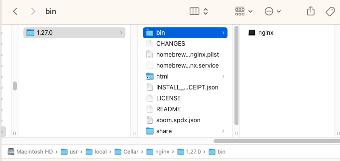
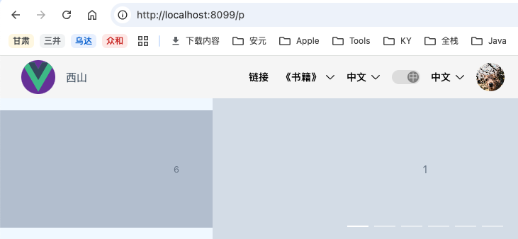

* [【深入浅出Nginx系列】Nginx入门？看这一篇就够了（概念篇）](https://blog.csdn.net/weixin_47025166/article/details/126041580)
* [【深入浅出Nginx系列】Nginx入门？看这一篇就够了（实战篇）](https://blog.csdn.net/weixin_47025166/article/details/126047843?csdn_share_tail=%7B%22type%22%3A%22blog%22%2C%22rType%22%3A%22article%22%2C%22rId%22%3A%22126047843%22%2C%22source%22%3A%22weixin_47025166%22%7D&ctrtid=FklNh)


# 一、Mac安装Nginx

* [Homebrew官网](https://brew.sh/)


## 1. 检查电脑是否有nginx

```sh
$ brew search nginx
==> Formulae
nginx ✔              # 说明已经安装
```


## 2. brew安装nginx

```sh
# 安装
$ brew install nginx

# 重装
$ brew reinstall nginx
```


## 3. 查看nginx安装路径

```sh
$ ps -ef | grep nginx
  501 82140     1   0  9:37AM ??         0:00.01 nginx: master process /usr/local/opt/nginx/bin/nginx -g daemon off;
  501 82141 82140   0  9:37AM ??         0:00.00 nginx: worker process
  501 83450 19715   0  9:54AM ttys014    0:00.00 grep --color=auto --exclude-dir=.bzr --exclude-dir=CVS --exclude-dir=.git --exclude-dir=.hg --exclude-dir=.svn nginx
```


## 4. 查看nginx的信息

* `$ ngxin -v`：查看nginx版本
* `$ nginx -V`：查看nginx版本及安装的本地位置

* `$ brew info nginx`：查看nginx信息

```sh
# 查看nginx版本
$ nginx -v
nginx version: nginx/1.25.5


# 查看nginx版本及安装的本地位置
$ nginx -V
nginx version: nginx/1.27.0
built by clang 15.0.0 (clang-1500.1.0.2.5)
built with OpenSSL 3.3.0 9 Apr 2024 (running with OpenSSL 3.3.1 4 Jun 2024)
TLS SNI support enabled
configure arguments: --prefix=/usr/local/Cellar/nginx/1.27.0 --sbin-path=/usr/local/Cellar/nginx/1.27.0/bin/nginx --with-cc-opt='-I/usr/local/opt/pcre2/include -I/usr/local/opt/openssl@3/include' --with-ld-opt='-L/usr/local/opt/pcre2/lib -L/usr/local/opt/openssl@3/lib' --conf-path=/usr/local/etc/nginx/nginx.conf --pid-path=/usr/local/var/run/nginx.pid --lock-
......


# 查看nginx详细信息
$ brew info nginx
==> nginx: stable 1.25.5 (bottled), HEAD
HTTP(S) server and reverse proxy, and IMAP/POP3 proxy server
https://nginx.org/
Installed
/opt/homebrew/Cellar/nginx/1.25.5 (26 files, 2.4MB) *
......
```


## 5. 查看 `nginx.conf` 配置文件路径

```sh
# 测试配置文件的正确性
$ nginx -t
nginx: the configuration file /opt/homebrew/etc/nginx/nginx.conf syntax is ok
nginx: configuration file /opt/homebrew/etc/nginx/nginx.conf test is successful
```


## 6. 查看帮助 `$ nginx -h`

```sh
$ nginx -h
nginx version: nginx/1.27.0
Usage: nginx [-?hvVtTq] [-s signal] [-p prefix]
             [-e filename] [-c filename] [-g directives]

Options:
  -?,-h         : this help
  -v            : show version and exit
  -V            : show version and configure options then exit
  -t            : test configuration and exit
  -T            : test configuration, dump it and exit
  -q            : suppress non-error messages during configuration testing
  -s signal     : send signal to a master process: stop, quit, reopen, reload
  -p prefix     : set prefix path (default: /usr/local/Cellar/nginx/1.27.0/)
  -e filename   : set error log file (default: /usr/local/var/log/nginx/error.log)
  -c filename   : set configuration file (default: /usr/local/etc/nginx/nginx.conf)
  -g directives : set global directives out of configuration file
```


## 7. 服务器路径⭐️

### a. 安装完以后，可以在终端输出的信息里看到一些配置路径

* 文件根目录：`/usr/local/var/www`

* 配置文件路径：`/usr/local/etc/nginx/nginx.conf`


### b. 通过查找原文件

```sh
# nginx路径
$ which nginx  
$ where nginx
/usr/local/bin/nginx
```





# 二、运行Nginx

```sh
# 启动
$ nginx

# 关闭
$ nginx -s stop

# 重新启动，热启动，修改配置重启不影响线上
$ nginx -s reload
```

**浏览器访问localhost:8080**：http://localhost:8080/

**如果页面出现---- Welcome to nginx! ------即代表成功**

【默认端口,如需更改请求配置文件conf更改】


## 1. 查看是否运行nginx

```sh
# 查看状态
$ ps -ef | grep nginx
```


## 2. `brew services start nginx` 对比

* [MacOS - brew 里运行 nginx 和直接运行 nginx ，有什么区别吗？](https://v2ex.com/t/812279)

```sh
# 启动服务
$ brew services start nginx

# 关闭
$ brew services stop nginx

# 重启
$ brew services restart nginx
```

brew services 是托管给 launchd 的，相当于系统服务。


# 三、文件目录

Homebrew 默认安装路径如下：

- macOS ARM：`/opt/homebrew`
- macOS Intel： `/usr/local`

```sh
# 显示 Homebrew Cellar 路径
$ brew --cellar
/opt/homebrew/Cellar

# 显示 Homebrew Caskroom 路径
$ brew --caskroom
/opt/homebrew/Caskroom
```


```sh
# nginx路径
$ which nginx  
$ where nginx
/usr/local/bin/nginx

# 配置文件路径
$ nginx -t
nginx: the configuration file /opt/homebrew/etc/nginx/nginx.conf syntax is ok
nginx: configuration file /opt/homebrew/etc/nginx/nginx.conf test is successful

# 查看nginx详情，也可以看到路径
$ brew info nginx
```


# 四、修改index.html文件

nginx允许成功后，打开 http://localhost:8080/ ，说明成功了。


a. 先找到nginx路径 `$ where nginx` ，找到 `/opt/homebrew/bin/nginx` :


可以发现文件是快捷入库，需要找到源文件


源文件地址：`/opt/homebrew/var/www`


我们找到源文件，修改试试：


# 五、配置文件设置

```sh
# 测试配置文件的正确性
$ nginx -t
nginx: the configuration file /opt/homebrew/etc/nginx/nginx.conf syntax is ok
nginx: configuration file /opt/homebrew/etc/nginx/nginx.conf test is successful
```


大致内容

```sh
#user  nobody;
worker_processes  1;

#error_log  logs/error.log;
#error_log  logs/error.log  notice;
#error_log  logs/error.log  info;

#pid        logs/nginx.pid;


events {
    worker_connections  1024;
}


http {
    include       mime.types;
    default_type  application/octet-stream;

    #log_format  main  '$remote_addr - $remote_user [$time_local] "$request" '
    #                  '$status $body_bytes_sent "$http_referer" '
    #                  '"$http_user_agent" "$http_x_forwarded_for"';

    #access_log  logs/access.log  main;

    sendfile        on;
    #tcp_nopush     on;

    #keepalive_timeout  0;
    keepalive_timeout  65;

    #gzip  on;

    server {
        listen       8082;
        server_name  localhost;

        #charset koi8-r;

        #access_log  logs/host.access.log  main;

        location / {
            root   html;
            index  index.html index.htm;
        }

        #error_page  404              /404.html;

        # redirect server error pages to the static page /50x.html
        #
        error_page   500 502 503 504  /50x.html;
        location = /50x.html {
            root   html;
        }

        # proxy the PHP scripts to Apache listening on 127.0.0.1:80
        #
        #location ~ \.php$ {
        #    proxy_pass   http://127.0.0.1;
        #}

        # pass the PHP scripts to FastCGI server listening on 127.0.0.1:9000
        #
        #location ~ \.php$ {
        #    root           html;
        #    fastcgi_pass   127.0.0.1:9000;
        #    fastcgi_index  index.php;
        #    fastcgi_param  SCRIPT_FILENAME  /scripts$fastcgi_script_name;
        #    include        fastcgi_params;
        #}

        # deny access to .htaccess files, if Apache's document root
        # concurs with nginx's one
        #
        #location ~ /\.ht {
        #    deny  all;
        #}
    }


    # another virtual host using mix of IP-, name-, and port-based configuration
    #
    #server {
    #    listen       8000;
    #    listen       somename:8080;
    #    server_name  somename  alias  another.alias;

    #    location / {
    #        root   html;
    #        index  index.html index.htm;
    #    }
    #}


    # HTTPS server
    #
    #server {
    #    listen       443 ssl;
    #    server_name  localhost;

    #    ssl_certificate      cert.pem;
    #    ssl_certificate_key  cert.key;

    #    ssl_session_cache    shared:SSL:1m;
    #    ssl_session_timeout  5m;

    #    ssl_ciphers  HIGH:!aNULL:!MD5;
    #    ssl_prefer_server_ciphers  on;

    #    location / {
    #        root   html;
    #        index  index.html index.htm;
    #    }
    #}
    include servers/*;
}
```


# 六、Vue项目部署到Nginx

https://juejin.cn/post/6844904096973979662


## 1. 打包Vue3 + Vite

最初是的项目，没有任何多余配置！！！

```sh
$ pnpm build
```


## 2. 放到nginx服务器下


## 3. 启动、运行

```sh
$ brew services restart nginx
```




### a. 问题：再次刷新 404


### b. 原因

* 官网：https://cli.vuejs.org/zh/guide/deployment.html#docker-nginx

* 参考：https://blog.csdn.net/qq_55272229/article/details/131540101
* 参考：https://learnku.com/articles/34440

因为vue打包输出的是单页网页应用，只有一个index.html入口，其他路径是由前端路由去跳转的，服务器目录下没有对应物理路径，所以就会报404。


## 4. 自定义包文件路径

目前包是放在根目录下，这样不规范，新建文件`xishan`，此刻链接就不对了！！！


