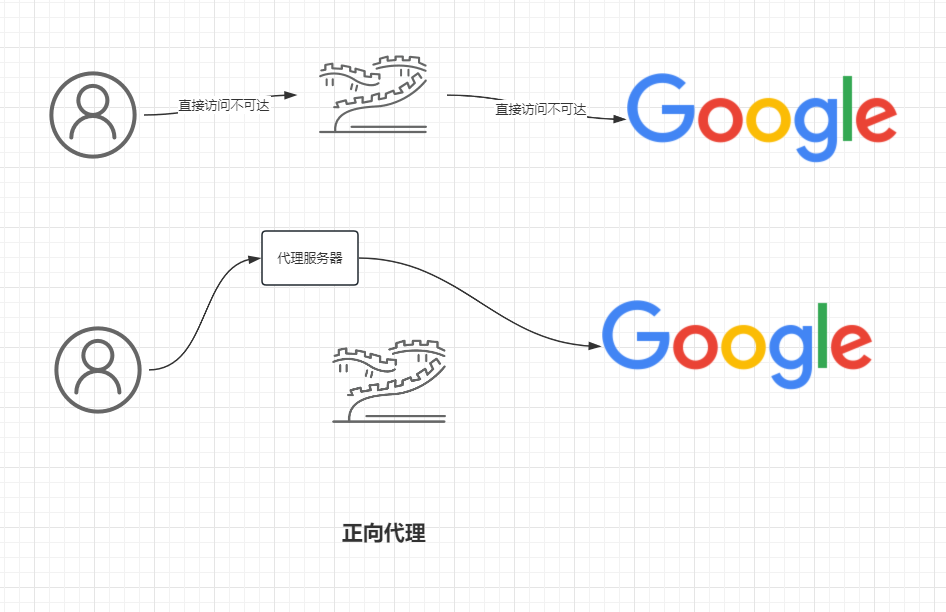
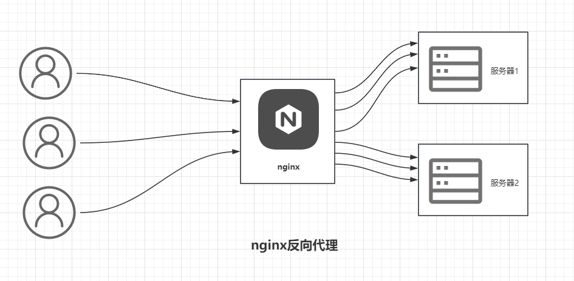
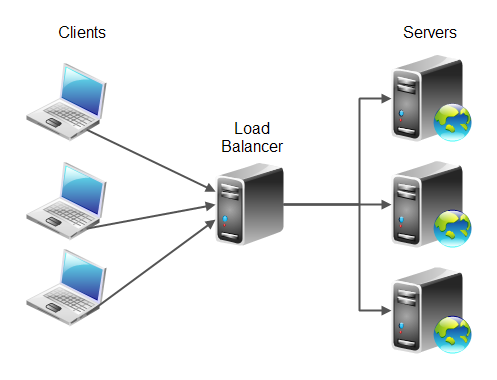
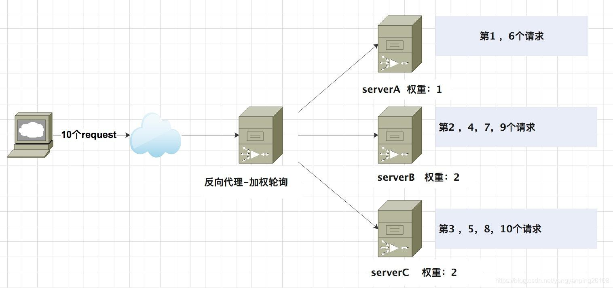
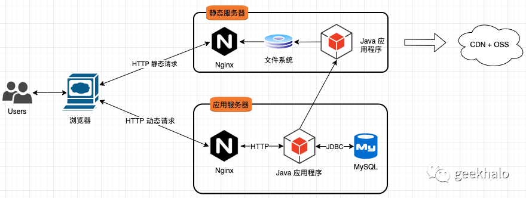

* [【深入浅出Nginx系列】Nginx入门？看这一篇就够了（概念篇）](https://blog.csdn.net/weixin_47025166/article/details/126041580)
* [【深入浅出Nginx系列】Nginx入门？看这一篇就够了（实战篇）](https://blog.csdn.net/weixin_47025166/article/details/126047843?csdn_share_tail=%7B%22type%22%3A%22blog%22%2C%22rType%22%3A%22article%22%2C%22rId%22%3A%22126047843%22%2C%22source%22%3A%22weixin_47025166%22%7D&ctrtid=FklNh)
* [bilibili - 90分钟入门nginx|手把手教学|项目部署必看](https://www.bilibili.com/video/BV1q94y1p7sq/?spm_id_from=333.337.search-card.all.click&vd_source=dc55c355e9f5b6174832aacfb5d8b6aa)
* [nginx使用文档](http://doc.fengfengzhidao.com/doc/43)

# 一、什么是Nginx

> **Nginx**是一个由俄罗斯的程序设计师**Igor Sysoev**所开发的高性能的HTTP和反向代理服务器。有着***占有内存少***，***并发能力强***的特点，在高连接高并发的情况下，Nginx能成为Apache服务器不错的替代品。

# 二、正向代理 与 反向代理

## 1. 正向代理

我们使用***浏览器***去访问大名鼎鼎的***Google***，此时**Google**作为外网，访问的时候需要翻墙，而这便会导致资源加载的特别慢。此时我们便可以通过***配置一个访问速度较快的代理服务器***去帮我们完成这一次任务，在本次过程中:

- 我们消费者
- 我们是被代理者

**而这种代理方式，便称为正向代理。**

## 2. 反向代理

假如你所在的公司研发了一套***Web服务***并搭建在不同的服务器上，此时，Web服务的每一台服务器是没有办法直接接收到用户的请求的。此时，你便可以通过***反向代理服务器***去接收来自互联网的请求并通过***负载均衡***将请求合理的分配到各个服务器中。在本次过程中：

- 我们是生产者（服务提供者）

**而这种方式，我们称之为反向代理**

# 三、负载均衡

负载均衡（Load Balance，简称 LB）是***高并发、高可用*** 系统必不可少的关键组件，目标是 ***尽力将网络流量平均分发到多个服务器上，以提高系统整体的响应速度和可用性。***

将原先请求集中到单个 服务器上的情况改为将请求分发到多个服务器上，将负载分发到不同的服务器，就是我们所说的***负载均衡。***

## 1. 轮询

该策略是Nginx默认的负载均衡策略，每一个客户端请求按时间顺序轮流分配到不同的服务器上，如果后端服务不可以用，会自动过滤掉。

**拿负载均衡中最常见的 *轮询* 举一个小例子：**

**图中共3台服务器，此时来了7个请求，在没有设置权重的情况下对请求进行分配：**

第一个请求----------第一个服务器

第二个请求----------第二个服务器

第三个请求----------第三个服务器

第四个请求----------第一个服务器

第五个请求----------第二个服务器

第六个请求----------第三个服务器

第七个请求----------第一个服务器

***通过轮询的方式使每一台服务器都尽可能被分发到相同数量的请求***

## 2. 设置权重的轮询方式

除了默认的轮询方式外，我们还可以为各个服务器设置权重 ，***为性能较强的服务器分配较高的权重，可以使相对更多的请求分配到这台服务器上***，从而达成对资源的合理利用。

# 四、动静分离

**动静分离**是指为了加快网站的解析速度，可以把 ***动态页面*** 和 **静态页面** 由**不同的服务器**来解析，加快解析速度，降低原来单个服务器的压力。

**先来看看什么是静态请求和动态请求：**

**静态请求：**客户端访问服务器的静态网页, 不涉及任何数据的处理

**动态页面：**客户端会将数据提交给服务器

**如下图所示：Nginx在静态服务器和动态服务器中针对动态请求和静态请求做了不同的处理**

**这样能够使：**

- 前后端开发并行，彼此互不干扰
- 减轻后端服务器压力，提高静态资源访问速度
- api接口服务化，即后端只需要通过提供api接口即可
