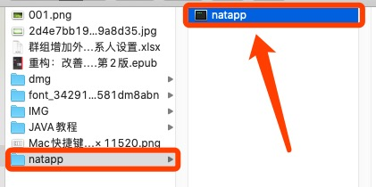
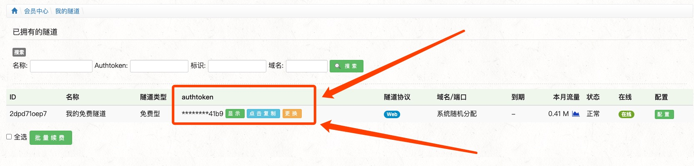
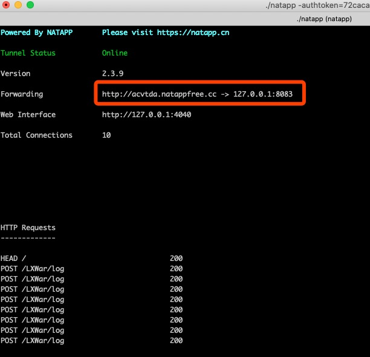

# 一、内网透传方案

* 收费 [花生壳](https://b.oray.com/)

* 自建 [FRP](https://github.com/fatedier/frp)

* 其他 [不用第三方实现内网穿透](https://blog.csdn.net/qq_37063860/article/details/83119887)

[简单的端口映射教程](https://zhuanlan.zhihu.com/p/43233032)


# 二、迅速使用 NATAPP

[官网 - NATAPP](https://natapp.cn/)

[教程 - 1分钟](https://juejin.im/post/5cad5e675188251b1b2f5517)


下载对应版本[download](https://natapp.cn/#download)

解压



前往对应的目录下

```
➜ natapp ls
natapp
```


开启权限

```
➜ chmod a+x natapp    // 方式一：给所有用户开启执行命令 

➜ sudo ./natapp ....  // 方式二：sudo执行
```


获取 并 配置authtoken




```sh
# 运行【linux】
$ ./natapp -authtoken=72cacadb11a24xxx
```

> Tunnel Status  Online 代表链接成功
> Version    当前客户端版本,如果有新版本,会有提示
> Forwarding   当前穿透 网址 或者端口
> Web Interface  是本地Web管理界面,可在隧道配置打开或关闭,仅用于web开发测试
> Total Connections 总连接数
> **Avg Conn Time 0.00ms 这里不代表,不代表,不代表 延时,需要注意!**




